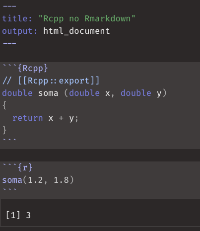
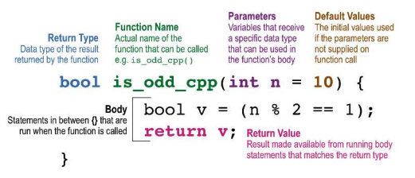

class: middle, center, inverse

# Acelerando o R com C++


```{r setup, include=FALSE}
knitr::opts_chunk$set(eval = TRUE, echo = TRUE, comment = "#>",
                      dpi = 96, fig.height = 4.7, 
                      fig.width = 10, fig.retina = 3)
library(tidyverse)
```

---

## Curso-R


---

## Linha do tempo

<center>
</img>
</center>

---

## Informações gerais

- As aulas vão das 9h às 13, com uma pausa de 10 min em torno das 11:00
- As aulas serão gravadas e disponibilizadas no Google Classroom
- Podem mandar dúvidas no chat do Zoom ou abrir o microfone para perguntar
- Teremos bastante exercícios para resolver durante o workshop, então se prepare!

## Informações de vocês

- Nós gostaríamos de saber sobre vocês:

  - Nome
  - Com o que trabalha?
  - Como imagina usar `{Rcpp}` no futuro?

---

## Nesse curso vamos falar de

.pull-left[

### Introdução

- Diferenças entre R e C++
- O que é {Rcpp}?
- Quando usar {Rcpp}?
- Introdução ao {Rcpp}

### Intermediário

- Usando matrizes e arrays
- Como interromper loops pelo R
- Casos de uso
- Ponteiros externos (XPtrs)

]

.pull-right[

### Miscelânea

- Pacotes com código C++
- Um pouco sobre a API do R em C
- Introdução ao `{cpp11}` 
- Paralelismo com {RcppParallel}

]

---

## Outros materiais

.pull-left[

- [Rcpp gallery](https://gallery.rcpp.org/)
- [Paper do Rcpp no JSS](https://cran.r-project.org/web/packages/Rcpp/vignettes/Rcpp-jss-2011.pdf)
- [FAQ do Rcpp](https://cran.r-project.org/web/packages/Rcpp/vignettes/Rcpp-FAQ.pdf)
- [Referência rápida](https://cran.r-project.org/web/packages/Rcpp/vignettes/Rcpp-quickref.pdf)
- [Capítulo do Advanced R](https://adv-r.hadley.nz/rcpp.html)
- [Rcpp for everyone](https://teuder.github.io/rcpp4everyone_en/)
- [Curso na UseR 2020](https://www.youtube.com/watch?v=57H34Njrns4)

]

.pull-right[

[](http://www.rcpp.org/book/)

]

---

## Diferenças entre R e C++

- As duas linguagens tem propósitos bastante diferentes. O R é uma linguagem focada em análise de dados e tem bastante desenvolvimento pensado na interatividade. 

- C++ é uma linguagem de mais baixo nível e tem foco em performance e proximidade com a linguagem de máquina. É uma linguagem de propósito muito mais geral.

- Apesar de as duas linguagens possuirem muitos paradigmas diferentes. R tende a ser uma linguagem funcional: em geral escrevemos o que queremos fazer e não o 'como fazer'. C++ é imperativa, o que implica em escrever exatamente o 'como fazer'.

Dito isso, as principais diferenças que precisam ser compreendidas por um programador R aprendendo C++ são:


---

## Diferenças entre R e C++

.pull-left[

### R

- **interpretada**: existe um interpretador que *parseia* o código e o executa. Esse processo ocorre toda vez que uma linha de código é executada.

- **tipada dinamicamente**: os tipos dos objetos só são verificados na hora da execução do código.

]

.pull-right[

### C++

- **(pré) compilada**: o código é compilado, isto é, transformado em linguagem de máquina e depois pode ser executado. Não é necessário nenhum interpretador para executar o código.

- **estaticamente tipada**: durante o processo de compilação verifica-se se os tipos estão corretos. Por exemplo: uma função que retorna um número inteiro só pode retornar um número inteiro.


]

---

## Diferenças entre R e C++

Além de todas as diferenças conceituais, é claro, as duas linguagens também diferem bastante com relação à sintaxe.

.pull-left[

```{r}
hello <- function(name) {
  print(paste("hello", name))
}
hello("world")
```

]

.pull-right[

```{Rcpp, cache=TRUE}
#include <Rcpp.h>
// [[Rcpp::export]]
void hello (std::string name)
{
  Rcpp::Rcout << 
    "hello " + name << 
      std::endl;
}
```

```{r, cache=TRUE}
hello("world")
```

]

---

## Rcpp

- O R é escrito principalmente em C (não é C++) e então o R possui uma API em C
que permite que você crie extensões.

- A API do R é difícil e exige que você conheça bastante detalhes da linguagem.
Além disso, você precisa entender bastante como funciona o *garbage collector*
para poder usar corretamente a API em C.

- Rcpp não apenas implementa uma forma de chamar funções do C++ a partir da API
do R que é escrita em C, como fornece um conjunto grande de *açúcar sintático* 
para você não precisar entender tantos detalhes da API C do R.

- O pacote Rcpp é um dos mais utilizados no CRAN e é atualmente a principal
ferramenta para criar extensões do R que utilizam C/C++

---

## Quando usar Rcpp?

Existem dois principais motivos para usar Rcpp:

- Você um código lento em R (geralmente envolvendo loops) que não é trivial de
vetorizar. Seu objetivo então, é escrever esse código em C++ para se beneficiar 
da velocidade, sem necessariamente precisar mudar o algoritmo.

Essa é talvez a forma mais comum de se usar Rcpp. Você escreve seu código em R,
e otimiza as partes que são *funis* de performance em C++. Pacotes como {text2vec},
{ranger}, {tm} e versões anteriores do {dplyr} usam Rcpp desta forma.

- Você deseja usar, pelo R, uma biblioteca já consolidada escrita em C++. 
Por exemplo, a [libmagick]() é uma biblioteca escrita em C++ que possui diversas
funções para manipulação de imagens - ao invés de re-escrever a sua funcionalidade
em R, usamos Rcpp para *conectá-la* ao R.

Pacotes como {magick}, {hunspell}, {haven}, {opencv} e etc. usam Rcpp desta forma. 

---

## Ambiente de desenvolvimento

.pull-left[

### Linux 

- Instalar o `r-base-dev`: rodar `sudo apt-get install r-base-dev`.

### Mac

- Instalar o Xcode Command Line Tools. Rodar: `xcode-select --install` no terminal.

]

.pull-right[

### Windows

- Instalar o [RTools](https://cran.r-project.org/bin/windows/Rtools/history.html): o RTools junta um compilador (MinGW) de código C++, um compilador de Latex e outras ferramentas úteis.

]

---

## Arquivos do tipo .cpp

O RStudio possui suporte para aquivos do tipo `.cpp` e vamos usá-lo como IDE.

.pull-left[

- Você pode usar a função `Rcpp::sourceCpp()` para compilar um arquivo `.cpp` a
partir do R.
  
- É possível usar a função `Rcpp::cppFunction()` para escrever os códigos em
scripts `.R`

- O RMarkdown permite programar nas duas linguagens, além de Markdown tradicional

- Vamos usar arquivos `.cpp` puros com comentários que permitem programar em R

]

.pull-right[



]

---

## Introdução ao Rcpp

O esquema abaixo apresenta o esqueleto de uma função C++. Preste bastante
atenção na declaração dos tipos dos objetos (tanto argumentos, quanto variáveis),
na especificação do tipo da saída, no ponto-e-vírgula depois de absolutamente
todas as linhas e no fato de que `return` é obrigatório (apesar de nem ser
uma função como no R).

.center[


Fonte: [*Extending R with C++: A Brief Introduction to Rcpp*](https://cran.r-project.org/web/packages/Rcpp/vignettes/Rcpp-introduction.pdf)
]

---
class: middle, center

### Exemplo 00

---
class: middle, center

### Exemplo 01

---

class: middle, center

### Exercício 01

---
## Vetores

Assim como o resto dos objetos do C++, vetores precisam ter seus tipos
especificados no momento de criação. Felizmente, há tipos específicos que
podemos usar sem ter muito trabalho. Aqui falaremos sobre `NumericVector`,
`StringVector` e `LogicalVector`.

```Rcpp
NumericVector v(n);
NumericVector v(n, k);
NumericVector v = NumericVector::create(Named("x") = 1, _["y"] = 2);
```

```Rcpp
StringVector v(n);
StringVector v(n, c);
StringVector v = StringVector::create(Named("x") = 'a', _["y"] = 'b');
```

Redimensionar vetores não é uma tarefa fácil! Muitas vezes o jeito mais simples
é copiar o vetor para um "esqueleto" vazio maior.

---
## Acessar elementos

Acessar elementos de vetores é tão simples quanto no R. Podemos usar tanto `[]`
quanto `()`: o primeiro ignora acessos fora dos limites e o segundo retorna um
erro. Ambos aceitam números (índices), strings (nomes) ou booleanos.

Atribuições funcionam exatamente da mesma forma que o R. **Note que os índices
sempre começam em 0!**

.pull-left[

```Rcpp
double x1          = v[n];
double x2          = v[c];
NumericVector res1 = v[numeric];
NumericVector res2 = v[integer];
NumericVector res3 = v[character];
NumericVector res4 = v[logical];
```

]

.pull-right[

```Rcpp
v[n]         = x1;
v[c]         = x2;
v[numeric]   = v2;
v[integer]   = v2;
v[character] = v2;
v[logical]   = v2;
```

]

---
## Atributos

Funções membras (também conhecidas como "métodos") são funções que pertencem a
um objeto, ou seja, para qualquer objeto de um dado tipo, você pode chamar as
suas funções membras com a sintaxe `v.f()`. Isso é comum no Python, mas apenas
pacotes que usam `{R6}` no R têm métodos.

```{r, echo=FALSE}
dplyr::tribble(
  ~`Função`, ~`Descrição`,
  "`length()`/`size()`", "Comprimento do vetor",
  "`names()`", "Nomes do vetor",
  "`fill(x)`", "Preencher o vetor com valor `x`",
  "sort()", "Ordenar o vetor",
  "`begin()`/`end()`", "Iteradores para o começo e o fim do vetor",
  "`push_back(x)`/`push_front(x)`", "Colocar o valor `x` no fim/início do vetor"
) %>%
  knitr::kable()
```

---
class: middle, center

## Exemplo 02

---
class: middle, center

## Exercício 02

---
class: middle, center

## Exercício 03

---
## NA, NaN, Inf & NULL

Dependendo do tipo do vetor que você está usando você vai precisar usar
diferentes símbolos para NA. Isso é consequência direta do fato do C++ ser
forte e estaticamente tipada: não podemos criar um vetor sem declarar seu tipo
e nem trocar o tipo de um vetor sem declarar a conversão.

```{r, echo=FALSE}
dplyr::tribble(
  ~`Vetor`, ~`Símbolo do NA`,
  "`NumericVector`", "`NA_REAL`",
  "`IntegerVector`", "`NA_INTEGER`",
  "`LogicalVector`", "`NA_LOGICAL`",
  "`CharacterVector`", "`NA_STRING`"
) %>%
  knitr::kable()
```

Para `Inf`, `-Inf` e `NaN` usamos os símbolos: `R_PosInf`, `R_NegInf` e `R_NaN`
respectivamente.

Para `NULL` usamos `R_NilValue`.

---
class: middle, center

## Exemplo 03

---
class: middle, center

## Exercício 04

---
class: middle, center

## Exercício 05

---
## Fluxo de controle

O fluxo de controle do C++ é praticamente idêntico ao do R, com algumas pequenas
diferenças no `for`.

.pull-left[

```Rcpp
if (x > 0)
  Rcout << "positivo" << std::endl;
else if (x < 0)
  Rcout << "negativo" << std::endl;
else
  Rcout << "zero" << std::endl;
```

Chaves são necessárias se o corpo de uma condição tiver mais de uma linha, assim
como no R também!

]

.pull-right[

```Rcpp
int n = 10;
while (n > 0) {
  Rcout << n << ", ";
  n--;
}
Rcout << "liftoff!" << std::endl;
```

```Rcpp
for (int n = 10; n > 0; n--) {
  Rcout << n << ", ";
}
Rcout << "liftoff!" << std::endl;
```

]

---
class: middle, center

## Exemplo 04

---
class: middle, center

## Exercício 06

---
## Data frames

Para criar um data frame, usamos a função `DataFrame::create()`, que recebe
vetores que servirão como as colunas. A sintaxe é muito parecida com a que vimos
até agora para vetores, com uma diferença importante: as colunas serão
**referências** aos vetores originais.

```Rcpp
NumericVector v = {1,2};

// Criando um data frame
DataFrame df = DataFrame::create(Named("V1") = v,
                                 Named("V2") = clone(v));
// Alterando o vetor v
v = v * 2;
```

No código acima, a coluna `V1` será multiplicada por 2, enquanto a coluna `V2`
permanecerá intocada.

---
## Atributos

As funções membras de data frames são muito parecidas com as dos vetores, mas
têm algumas distinções importantes. No geral, os métodos operam nas colunas e
não nos elementos como acontecia antes com os vetores.

```{r, echo=FALSE}
dplyr::tribble(
  ~`Função`, ~`Descrição`,
  "`length()`/`size()`", "Número de colunas",
  "`nrows()`", "Número de linhas",
  "`names()`", "Nomes das colunas",
  "`fill(x)`", "Preencher todas as colunas com valor `x`",
  "`begin()`/`end()`", "Iteradores para a primeira/última coluna",
  "`push_back(x)`/`push_front(x)`", "Colocar o vetor `x` no fim/início da data frame"
) %>%
  knitr::kable()
```

---
class: middle, center

## Exemplo 05

---
class: middle, center

## Exercício 07

---
## RcppArmadillo

`{RcppArmadillo}` é um pacote de álgebra linear que consegue acelerar _ainda
mais_ operações com vetores e matrizes. Aqui vamos dar apenas um pequeno exemplo
de como ela funciona, mas existem infinitas possibilidades de como usar essa
biblioteca.

```Rcpp
#include <RcppArmadillo.h>
using namespace arma;

vec v;
v.subvec(from, to);                           // Acesso contíguo

mat M;
M.t()                                         // Matriz transposta
M.reshape()                                   // Redimensionar matrix
M(i, j)                                       // Acessar elemento
inv(M)                                        // Matriz inversa
M.submat(row_from, col_from, row_to, col_to); // Acesso contíguo
```

---
class: middle, center

## Exemplo 06

---
class: middle, center

## Exercício 08

---
## Chamando funções do R

É possível chamar funções do R pelo Rcpp e, para isso, usamos o tipo `Function`.
Note que é necessário saber exatamente o tipo de saída retornado pela função!

.pull-left[

```{Rcpp, cache = TRUE}
#include <Rcpp.h>
using namespace Rcpp;

// [[Rcpp::export]]
NumericVector f1(Function f) {
  return f(1);
}
```

```{r, cache = TRUE}
f1(function(x) x + 100)
```

]

.pull-right[

Programar em C++ é uma tarefa árdua no começo, mas extremamente recompensadora.
Depois de alguns dias batalhando contra erros, sua programação vai ficar
consideravelmente mais "defensiva".

```{r, cache = TRUE, error = TRUE}
f1(as.character)
```

]

---
class: middle, center

## Exemplo 07

---
## Rápido mas perigoso

Já ficou provado que o C++ pode tornar um programa em R exponencialmente mais
rápido, mas isso também pode trazer alguns problemas. Um deles é a dificuldade
de interromper a execução de um programa! Um loop rodando em `{Rcpp}` pode ser
impossível de parar da mesma forma que faríamos com a tecla `ESC` em um loop
R comum.

```Rcpp
void forever()
{
  for (int i = 0; true; i++)
  {
    Rcout << "Iteration: " << i << std::endl;
    ::sleep(1);
    Rcpp::checkUserInterrupt();
  }
}
```

---
class: middle, center

## Exemplo 08

---
class: middle, center

## Exercício 09

---

## STL

A [*Standard Templates Library*](https://pt.wikipedia.org/wiki/Standard_Template_Library) possui implementação eficiente e segura de muitos algoritmos e estruturas de dados.

- No curso vamos apenas fazer um exemplo!
- Recomendo ler [aqui](https://adv-r.hadley.nz/rcpp.html#stl) para uma introduçãoum pouco mais completa.

---

## Exemplo 09

---

## Exercício 10

---

## Ponteiros externos (XPtrs)

Muitas vezes queremos persistir objetos que criamos no C++, motivos incluem:

- Esses objetos são complicados para serem representados no R.
- Os objetos são demorados para serem reconstruidos e você quer aproveitar aproveitar que o cálculo.

Para isso usamos o template `Rcpp::XPtr`. 

---

class: middle, center

## Exemplo 10

---
## API do R

**Alerta:** Cenas fortes de alocação de memória nos próximos slides.

Como já comentado, o R por dentro é escrito majoritariamente em C. Isso quer
dizer que é possível acessar a interface interna do R e escrever código
diretamente em C. O lugar onde isso fica mais visível é no código de algumas
funções base do R (e outros pacotes específicos):

```{r}
purrr::map
```

---
## API do R

Diferentemente do `{Rcpp}`, a API C não lida com *garbage collector*, então é
necessário liberar toda a memória reservada durante a execução de uma função.
Além disso, o único verdadeiro tipo de objeto na API C é a `SEXP` (expressão
simbólica), que tem inúmeros subtipos que reperesentam os objetos do R.

```{r, message=FALSE}
pryr::sexp_type(10L)
pryr::sexp_type("a")
pryr::sexp_type(TRUE)
```

---

## Pacotes com código C++

- O código C++ vai na pasta `src`.
- A função `usethis::use_rcpp()` vai fazer tudo pra gente!
- Adicionar código C++ em um pacote é uma decisão importante (principalmente se você for colocar no CRAN): aumenta bastante a complexidade de manutenção.
Compilar código em diferentes compiladores pode ser complicado.

Referência: https://r-pkgs.org/src.html

---
## API do R

A maior vantagem de aprender a API C é entender melhor como o R funciona. O
resto é desvantagem.

```{r}
cria_vetor <- inline::cfunction(body = "
  SEXP num = PROTECT(allocVector(REALSXP, 4));
  UNPROTECT(1);
  return num;
")

cria_vetor()
```

`allocVector()` abre espaço para um vetor sem limpar a memória que está lá.
`PROTECT()` protege a expressão do *garbage collector* e`UNPROTECT()` libera os
últimos `n` objetos protegidos.

---
class: middle, center

## Exemplo 11

---
## RcppParallel

O `{RcppParallel}` é uma ferramenta para processamento paralelo no R através do
`{Rcpp}`. Diferentemente de grande parte das funções paralelas do R padrão, o 
`{RcppParallel}` trabalha com a `oneTBB` (que também funciona no Windows).

Ele disponibiliza uma interface de alto nível para quem quer simplicidade
(`parallelFor()` e `parallelReduce()`) e uma de baixo nível para quem quer lidar
com o *threads* individualmente (através da `TinyThread++`).

Como se não bastasse, o `{RcppParallel}` tem estruturas de dados (`RVector` e
`RMatrix`) e diversos algoritmos já preparados para trabalhar em ambientes
paralelos. O [TCC do Caio](https://lente.dev/ddr-ug.pdf) foi feito inteiro
usando o `{RcppParallel}`!

```Rcpp
// [[Rcpp::depends(RcppParallel)]]
#include <RcppParallel.h>
using namespace RcppParallel;
```

---
## RcppParallel

É um pouco difícil de aprender a usar o `{RcppParallel}` e não conseguiremos
abordar tudo aqui, mas a [documentação](https://rcppcore.github.io/RcppParallel/)
é bastante completa.

O conceito mais importante é o "trabalhador": ele é uma estrutura que define o
formado das entradas e saídas e um `operator()` que será chamado pelo
`parallelFor()`.

O `parallelFor()`, por sua vez, recebe os índices do início/fim do vetor de
entrada e um functor (mistura de função com entradas e saídas) para aplicar.

```Rcpp
struct SquareRoot : public Worker {}
void operator()(std::size_t begin, std::size_t end) {}

SquareRoot functor(input, output);
parallelFor(0, x.size(), functor);
```

---
class: middle, center

## Exemplo 12

---

## cpp11

O pacote cpp11 tem objetivos parecidos com o Rcpp e foi implementado mais recentemente.

Os problemas com o Rcpp que ele tenta resolver são:

- Ficar mais seguro em usar a API C do R (principalmente lidar com erros)
- Suporte a objetos ALTREP
- Compilar mais rápido e precisar de menos memória.

---

class: middle, center

## Exemplo 13: introCpp11.cpp

---

class: middle, center

## Obrigado
